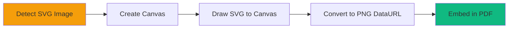

# HTML → Vector PDF (Vector Engine)

A powerful, client-side library for generating vector-based PDFs from HTML content. Unlike traditional screenshot-based converters, this engine renders text as true text (selectable & searchable) and shapes as vectors, ensuring high-quality output at any zoom level.

[中文文档](./README_zh.md)

## 🚀 Features

- **Vector-First Rendering**: Text remains text, borders become vector lines. High-quality print output.
- **Client-Side Only**: Runs entirely in the browser using `jspdf`. No server required.
- **Single File Drop-in**: Zero-dependency integration (except the bundled jspdf) via a single script file.
- **Smart Layout**:
  - Handles text wrapping and alignment matching browser behavior.
  - Supports standard CSS borders (individual side colors/widths).
  - Background colors.
  - Image rendering (including automatic SVG-to-PNG conversion).
- **Pagination Control**: Automatic page breaks with support for manual break triggers.
- **Configurable**: Extensive options for margins, page size, and format.

## 📊 Architecture Flow

### Overall Processing Pipeline


### Core Rendering Engine


### Text Processing Flow


## 📦 Usage

### 1. Include the Script
Include the generated script in your HTML file.

```html
<script src="./dist/html_to_vector_pdf.js"></script>
```

### 2. One-Click Init (Button Inject/Bind)
The library also exposes a small product API for one-click export:

```html
<script>
  HtmlToVectorPDF.init({
    selector: '.html_to_vector_pdf',
    button: { mode: 'inject' }, // or: { mode: 'bind', targetSelector: '#download-btn' }
    onProgress: (stage, detail) => console.log(stage, detail),
    onError: (err) => console.error(err.code, err.message, err.meta)
  });
</script>
```

### 3. Basic Export
Call `html_to_vector_pdf.generatePdf(target, config)`.

`target` can be:
- an element id (e.g. `"my-report"`)
- a CSS selector (e.g. `"#my-report"` / `".html_to_vector_pdf"`)
- an `HTMLElement`

If a selector matches multiple nodes, they are exported in DOM order and appended into the same PDF (see `index_multi.html`).

```html
<div class="html_to_vector_pdf" id="my-report">
  <h1>Monthly Report</h1>
  <p>This text will be selectable in the PDF.</p>
</div>

<button onclick="downloadReport()">Download PDF</button>

<script>
  function downloadReport() {
    html_to_vector_pdf.generatePdf('.html_to_vector_pdf', {
      filename: 'report.pdf',
      pageSize: 'a4',
      margins: { top: 10, right: 10, bottom: 10, left: 10 }
    });
  }
</script>
```

### 4. Margins (Global Override)

The default margins are **10mm**. You can override them in `config` or globally:

```javascript
// Global override (highest priority)
window.html_to_vector_pdf_margins = { top: 6.35, bottom: 6.35, left: 6.35, right: 6.35 };
```

### 4.1 Page Size and Orientation (Global Override)

You can also override the page size and orientation globally:

```javascript
// Override page size (default: 'a4')
window.html_to_vector_pdf_page_size = 'letter'; // or 'a4'

// Override orientation (default: 'portrait')
window.html_to_vector_pdf_orientation = 'landscape'; // or 'portrait'
```

**Priority order** (highest to lowest):
1. Global variables (`window.html_to_vector_pdf_*`)
2. Config parameter passed to `generatePdf()`
3. Default values


### 5. Forced Page Breaks
Add a `data-pdf-page-break-before="true"` attribute to force a new page before an element.

```html
<div data-pdf-page-break-before="true"></div>
```

### 6. Consistent Scaling (Recommended)
If your printable area uses a fixed pixel width (example: `.pdf-page { width: 750px; }`), you can map that width to the PDF page width to reduce overflow/wrapping differences:

```js
const margins = { top: 6.35, right: 6.35, bottom: 6.35, left: 6.35 };
const pageWidthMm = 210; // A4 portrait width
const baseWidthPx = document.querySelector('.pdf-page')?.getBoundingClientRect().width || 750;
const pxToMm = (pageWidthMm - margins.left - margins.right) / baseWidthPx;

await html_to_vector_pdf.generatePdf('.html_to_vector_pdf', { margins, render: { pxToMm } });
```

## ⚙️ Configuration

The `generatePdf` function accepts a configuration object with the following options:

| Option | Type | Default | Description |
|--------|------|---------|-------------|
| `filename` | `string` | `"document.pdf"` | Name of the output file. |
| `pageSize` | `"a4" \| "letter"` | `"a4"` | Page size standard. |
| `orientation` | `"portrait" \| "landscape"` | `"portrait"` | Page orientation. |
| `margins` | `{ top, right, bottom, left }` | `{ top:10, right:10, bottom:10, left:10 }` | Margins in millimeters. |
| `excludeSelectors` | `string[]` | (built-in list) | Elements matching these selectors are skipped. |
| `callbacks.onProgress` | `(stage, detail) => void` | (none) | Progress hook (parsing/rendering/saving). |
| `callbacks.onError` | `(error) => void` | (none) | Error hook with deterministic error codes. |
| `performance.yieldEveryNodes` | `number` | `250` | Async yield cadence to reduce UI freezes. |
| `performance.yieldEveryMs` | `number` | `16` | Minimum time between yields. |
| `errors.failOnAssetError` | `boolean` | `false` | Throw on image/svg failures (default keeps going). |
| `text.scale` | `number` | `1` | Global scaling factor for text size. |
| `render.pxToMm` | `number` | (auto) | Override px→mm conversion for consistent scaling. |
| `pagination.pageBreakBeforeSelectors` | `string[]` | `[".pagebreak_bf_processed","[data-pdf-page-break-before=\"true\"]"]` | CSS selectors that force a new page before an element. |
| `debugOverlay.enabled` | `boolean` | `false` | Draws debug rectangles (table cell content boxes). |
| `debug` | `boolean` | `false` | Enable console logging for layout debugging. |

## 🔧 Technical Implementation

### Pixel to Millimeter Conversion
The engine uses dynamic calibration to ensure accurate dimension conversion:

```typescript
// Create a 100mm wide probe element
const probe = document.createElement('div');
probe.style.width = '100mm';
document.body.appendChild(probe);

// Measure actual pixel width
const widthPx = probe.getBoundingClientRect().width;
const pxToMm = 100 / widthPx;
```

### Render Item Priority (zIndex)
- **0**: Background colors
- **5**: Images
- **10**: Borders
- **12**: Debug rectangles (if enabled)
- **20**: Text content

### SVG Image Processing
SVG images are automatically converted to PNG to ensure cross-platform compatibility:



## ⚠️ Notes / Limitations

- **Not a full browser print engine**: Complex CSS (filters, transforms, pseudo elements, advanced layout) may not match exactly.
- **Cross-origin images**: SVG-to-canvas conversion requires CORS headers; otherwise the browser may block rendering.
- **Defaults may be project-oriented**: `excludeSelectors` includes a few project-specific class names; override with `excludeSelectors: []` (or your own list) if you want generic behavior.

## 🔍 Debugging

The library includes a **Debug Overlay** feature that draws red rectangles around the content boxes of table cells (`TD`/`TH`). This is useful for verifying layout alignment and padding detection.

### 1. Toggle via URL (Recommended)
You can enable the overlay on any demo page or implementation using the `debugOverlay` query parameter:
- **Enable**: `?debugOverlay=1` or `?debugOverlay=true`
- **Disable**: `?debugOverlay=0` or `?debugOverlay=false`

### 2. Toggle via Console
You can also set a global flag in your browser's DevTools console:
```javascript
window.HTML_TO_VECTOR_PDF_DEBUG_OVERLAY = true;
```

### 3. Programmatic Control
Pass the `debugOverlay` option directly to `generatePdf`:
```javascript
html_to_vector_pdf.generatePdf('.target', {
  debugOverlay: { 
    enabled: true,
    strokeColorRgb: [255, 0, 0], // Red
    lineWidthMm: 0.15 
  },
  debug: true // Enables console logging
});
```

## 🛠️ Development

This project is built with **Vite** and **TypeScript**.

### Prerequisites
- Node.js (v20+)

### Installation
```bash
npm install
```

### Build Library
Builds the standalone `html_to_vector_pdf.js` library to the `dist/` folder.
```bash
npm run build
```

### Demo Files
- `index.html`: single `.html_to_vector_pdf` example (loads `./dist/html_to_vector_pdf.js`)
- `index_multi.html`: multiple `.html_to_vector_pdf` elements merged into one PDF

After `npm run build`, HTML demo files are copied into `dist/` with the script path rewritten to `./html_to_vector_pdf.js` so you can open them directly.

## 📄 License
Private
