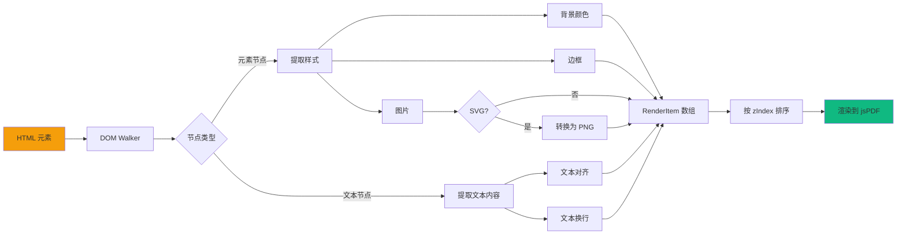
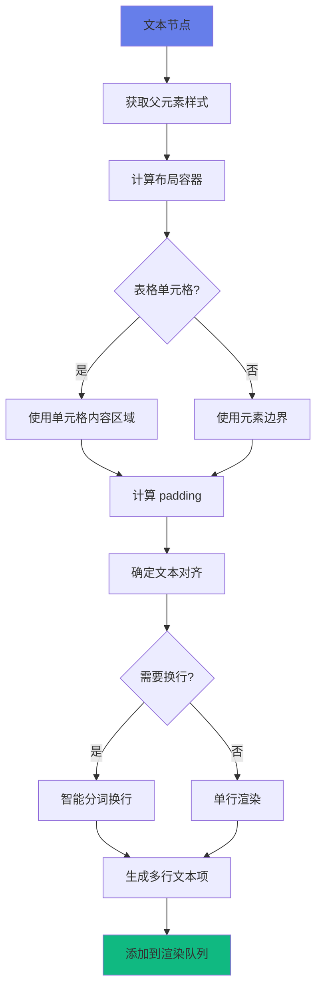

# HTML → Vector PDF (矢量引擎)

一个强大的客户端库，用于从 HTML 内容生成基于矢量的 PDF。与传统的截图转换器不同，该引擎将文本渲染为真正的文本（可选择和搜索），将形状渲染为矢量，确保在任何缩放级别下都能获得高质量的输出。

[English Documentation](./README.md)

## 🚀 核心特性

- **矢量优先渲染**：文本保持为文本，边框转换为矢量线条。高质量打印输出。
- **纯客户端**：完全在浏览器中使用 `jspdf` 运行。无需服务器。
- **单文件集成**：通过单个脚本文件实现零依赖集成（除了捆绑的 jspdf）。
- **智能布局**：
  - 处理文本换行和对齐，匹配浏览器行为。
  - 支持标准 CSS 边框（单独的边颜色/宽度）。
  - 背景颜色。
  - 图像渲染（包括自动 SVG 转 PNG）。
- **分页控制**：自动分页，支持手动分页触发器。
- **可配置**：边距、页面大小和格式的广泛选项。

## 📊 架构流程图

### 整体处理流程

```mermaid
graph TB
    A[用户调用 generatePdf] --> B[查找并验证元素]
    B --> C[等待渲染就绪]
    C --> D{遍历元素}
    D --> E[DOM 解析为渲染项]
    E --> F[性能让步 (Yield)]
    F --> D
    D -->|完成| G[提取所有文本]
    G --> H[处理并加载字体]
    H --> I[渲染到 PDF]
    I --> J[保存文件]
    
    style A fill:#667eea
    style C fill:#f59e0b
    style H fill:#f59e0b
    style J fill:#10b981
```

### 核心渲染引擎



### 文本处理流程



## 📦 使用方法

### 1. 引入脚本
在 HTML 文件中引入生成的脚本。

```html
<script src="./dist/html_to_vector_pdf.js"></script>
```

### 2. 一键初始化（注入/绑定按钮）
库也提供了一个更偏产品形态的一键导出 API：

```html
<script>
  HtmlToVectorPDF.init({
    selector: '.html_to_vector_pdf',
    button: { mode: 'inject' }, // 或：{ mode: 'bind', targetSelector: '#download-btn' }
    onProgress: (stage, detail) => console.log(stage, detail),
    onError: (err) => console.error(err.code, err.message, err.meta)
  });
</script>
```

### 3. 基础导出
调用 `html_to_vector_pdf.generatePdf(target, config)`。

`target` 可以是：
- 元素 id（例如 `"my-report"`）
- CSS 选择器（例如 `"#my-report"` / `".html_to_vector_pdf"`）
- `HTMLElement` 对象

如果选择器匹配多个节点，它们将按 DOM 顺序导出并附加到同一个 PDF 中（参见 `index_multi.html`）。

```html
<div class="html_to_vector_pdf" id="my-report">
  <h1>月度报告</h1>
  <p>此文本在 PDF 中可选择。</p>
</div>

<button onclick="downloadReport()">下载 PDF</button>

<script>
  function downloadReport() {
    html_to_vector_pdf.generatePdf('.html_to_vector_pdf', {
      filename: 'report.pdf',
      pageSize: 'a4',
      margins: { top: 10, right: 10, bottom: 10, left: 10 }
    });
  }
</script>
```

### 4. 边距（全局覆盖）

默认边距为 **10mm**。您可以在 `config` 中或全局覆盖它们：

```javascript
// 全局覆盖（最高优先级）
window.html_to_vector_pdf_margins = { top: 6.35, bottom: 6.35, left: 6.35, right: 6.35 };
```

### 4.1 页面尺寸与方向（全局覆盖）

您也可以全局覆盖页面尺寸和方向：

```javascript
// 覆盖页面尺寸（默认：'a4'）
window.html_to_vector_pdf_page_size = 'letter'; // 或 'a4'

// 覆盖方向（默认：'portrait'）
window.html_to_vector_pdf_orientation = 'landscape'; // 或 'portrait'
```

**优先级顺序**（从高到低）：
1. 全局变量（`window.html_to_vector_pdf_*`）
2. 传递给 `generatePdf()` 的配置参数
3. 默认值

### 5. 强制分页
添加 `data-pdf-page-break-before="true"` 属性以在元素之前强制新页面。

```html
<div data-pdf-page-break-before="true"></div>
```

### 6. 一致的缩放（推荐）
如果您的可打印区域使用固定像素宽度（例如：`.pdf-page { width: 750px; }`），您可以将该宽度映射到 PDF 页面宽度以减少溢出/换行差异：

```js
const margins = { top: 6.35, right: 6.35, bottom: 6.35, left: 6.35 };
const pageWidthMm = 210; // A4 纵向宽度
const baseWidthPx = document.querySelector('.pdf-page')?.getBoundingClientRect().width || 750;
const pxToMm = (pageWidthMm - margins.left - margins.right) / baseWidthPx;

await html_to_vector_pdf.generatePdf('.html_to_vector_pdf', { margins, render: { pxToMm } });
```

## ⚙️ 配置选项

`generatePdf` 函数接受以下配置对象：

| 选项 | 类型 | 默认值 | 描述 |
|------|------|--------|------|
| `filename` | `string` | `"document.pdf"` | 输出文件名。 |
| `pageSize` | `"a4" \| "letter"` | `"a4"` | 页面大小标准。 |
| `orientation` | `"portrait" \| "landscape"` | `"portrait"` | 页面方向。 |
| `margins` | `{ top, right, bottom, left }` | `{ top:10, right:10, bottom:10, left:10 }` | 边距（毫米）。 |
| `excludeSelectors` | `string[]` | (内置列表) | 匹配这些选择器的元素将被跳过。 |
| `callbacks.onProgress` | `(stage, detail) => void` | (无) | 进度回呼（解析/渲染/保存）。 |
| `callbacks.onError` | `(error) => void` | (无) | 错误回呼（带确定性的错误码）。 |
| `performance.yieldEveryNodes` | `number` | `250` | 异步让出节奏，降低 UI 卡顿。 |
| `performance.yieldEveryMs` | `number` | `16` | 两次 yield 的最小间隔。 |
| `errors.failOnAssetError` | `boolean` | `false` | 图片/SVG 失败时是否直接抛错（默认继续）。 |
| `text.scale` | `number` | `1` | 文本大小的全局缩放因子。 |
| `render.pxToMm` | `number` | (自动) | 覆盖 px→mm 转换以实现跨布局的一致缩放。 |
| `pagination.pageBreakBeforeSelectors` | `string[]` | `[".pagebreak_bf_processed","[data-pdf-page-break-before=\"true\"]"]` | 在元素之前强制新页面的 CSS 选择器。 |
| `debugOverlay.enabled` | `boolean` | `false` | 绘制调试矩形（表格单元格内容框）。 |
| `debug` | `boolean` | `false` | 启用控制台日志记录以进行布局调试。 |

## 🔧 技术实现细节

### 像素到毫米转换
引擎使用动态校准来确保准确的尺寸转换：

```typescript
// 创建一个 100mm 宽的探测元素
const probe = document.createElement('div');
probe.style.width = '100mm';
document.body.appendChild(probe);

// 测量实际像素宽度
const widthPx = probe.getBoundingClientRect().width;
const pxToMm = 100 / widthPx;
```

### 渲染项优先级（zIndex）
- **0**: 背景颜色
- **5**: 图片
- **10**: 边框
- **12**: 调试矩形（如果启用）
- **20**: 文本内容

### SVG 图片处理
SVG 图片自动转换为 PNG 以确保跨平台兼容性：


## ⚠️ 注意事项 / 限制

- **不是完整的浏览器打印引擎**：复杂的 CSS（滤镜、变换、伪元素、高级布局）可能无法完全匹配。
- **跨域图片**：SVG 到 canvas 的转换需要 CORS 头；否则浏览器可能会阻止渲染。
- **默认值可能面向项目**：`excludeSelectors` 包含一些项目特定的类名；如果您想要通用行为，请使用 `excludeSelectors: []`（或您自己的列表）覆盖。

## 🔍 调试

库包含**调试覆盖**功能，可在表格单元格（`TD`/`TH`）的内容框周围绘制红色矩形。这对于验证布局对齐和填充检测很有用。

### 1. 通过 URL 切换（推荐）
您可以使用 `debugOverlay` 查询参数在任何演示页面或实现上启用覆盖：
- **启用**: `?debugOverlay=1` 或 `?debugOverlay=true`
- **禁用**: `?debugOverlay=0` 或 `?debugOverlay=false`

### 2. 通过控制台切换
您还可以在浏览器的 DevTools 控制台中设置全局标志：
```javascript
window.HTML_TO_VECTOR_PDF_DEBUG_OVERLAY = true;
```

### 3. 编程控制
直接将 `debugOverlay` 选项传递给 `generatePdf`：
```javascript
html_to_vector_pdf.generatePdf('.target', {
  debugOverlay: { 
    enabled: true,
    strokeColorRgb: [255, 0, 0], // 红色
    lineWidthMm: 0.15 
  },
  debug: true // 启用控制台日志记录
});
```

## 🛠️ 开发

此项目使用 **Vite** 和 **TypeScript** 构建。

### 前置要求
- Node.js (v20+)

### 安装
```bash
npm install
```

### 构建库

项目提供两种构建选项：

#### 1. 标准构建（轻量级，~100KB）
不嵌入字体的构建。仅支持标准拉丁字体。
```bash
npm run build
```
**使用场景**：开发、测试，或不需要 CJK（中文/日文/韩文）字体支持时。

#### 2. 完整构建（带字体，~2-5MB）
嵌入 CJK 字体（Noto Sans SC/JP/KR）的构建。
```bash
npm run build:with-fonts
```
**使用场景**：生产部署，需要完整的国际字符支持时。

两个命令都会输出到 `dist/html_to_vector_pdf.js`。

### 演示文件
- `index.html`: 单个 `.html_to_vector_pdf` 示例（加载 `./dist/html_to_vector_pdf.js`）
- `index_multi.html`: 多个 `.html_to_vector_pdf` 元素合并到一个 PDF 中

在 `npm run build` 之后，HTML 演示文件会被复制到 `dist/` 中，脚本路径被重写为 `./html_to_vector_pdf.js`，因此您可以直接打开它们。

## 📄 许可证
Private
